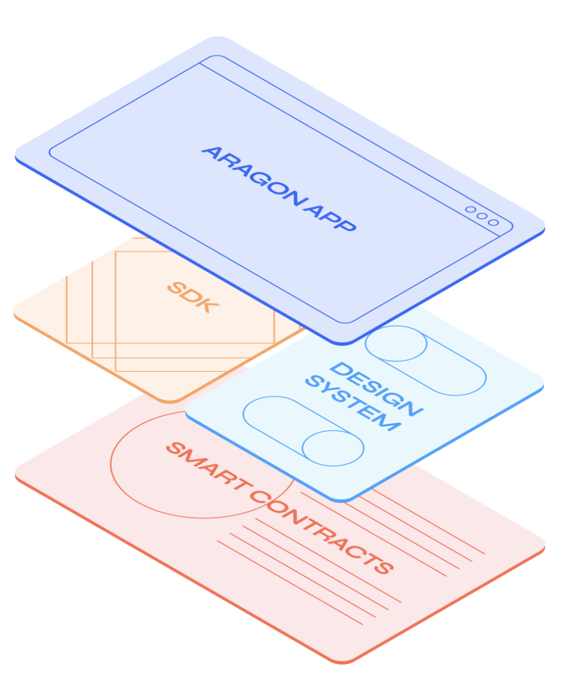
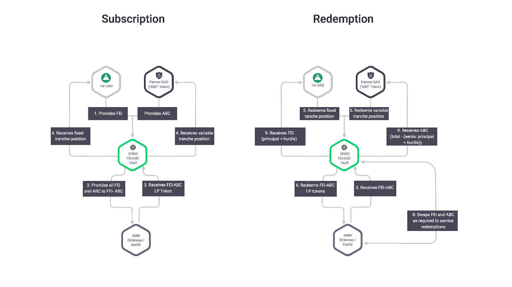

# Decentralized technologies as a service 

Web 2.0 and the cloud coined the term "as a service" - PaaS, SaaS, etc. Today Web 3.0 is following suite and various solutions are coming to light that offer generic services from blockchains to bootstrapping liquidity for DeFi protocols allowing entrepreneurs to bring ideas to market a lot quicker.

I am creating this repo to track Web 3.0 solutions that can be used "as a service".  These services can offer no code setup with UI and composable smart contracts when more control/customization is required.

You'll find resources below organized in the following categories: DAO governance, DAO treasury, DEX, Infrastructure, Token liquidity, Contract/Transaction automation, Oracles

## DAO Governance as a service

|Diagram| Name          | Description    | Runtime    |         
|-------      | -------       | ------         | ------   |
||[Aragon](https://aragon.org/aragon-app)|Easily create and run your DAO – without needing to code. Learn and adapt your DAO as you grow.|Ethereum or EVM Equivalent|
||[Element governance](https://medium.com/element-finance/an-introduction-to-elements-governance-model-efea13d1c7ee)|The core governance system consists of on-chain vote counting, proposal thresholds, custom quorum requirements, and a timelock for executing security-critical votes. Additionally, we developed a new concept called Voting Vaults that allows governance users to delegate assets for governance while retaining the ability to use the same assets for any other purpose in DeFi, such as earning yield or leveraging.|Ethereum or EVM Equivalent|
||[OpenZeppelin Governor](https://blog.openzeppelin.com/governor-smart-contract/)|OpenZeppelin Governor provides compatibility with Compound’s GovernorAlpha and GovernorBravo for easy migration of protocols and dapps while offering ease of customization, modularity, and significant gas cost reductions. Many modules are presented in two variants, one of which is fully compatible with Compound’s governance systems.|Ethereum or EVM Equivalent|
||[Commonwealth.io](https://docs.commonwealth.im/commonwealth/)|Commonwealth combines the core functionality of Discourse, Snapshot, on-chain voting, and network analytics all into one place via a crypto-native product. This means decentralized governance, community discussions, treasury management, and more happen all on Commonwealth.|Ethereum or EVM Equivalent|
||[Snapshot.org](https://docs.snapshot.org/)|Snapshot is a decentralized voting system. It provides flexibility on how voting power is calculated for a vote. Snapshot supports various voting types to cater to the needs of organizations. Creating proposals and voting on Snapshot is user-friendly and does not cost gas as the process is performed off-chain. In short, Snapshot is an off-chain gasless multi-governance client with easy to verify and hard to contest results.|Ethereum or EVM Equivalent|
||[Tally](https://docs.tally.xyz/user-guides-1/supported-dao-frameworks)|Tally supports DAOs on Ethereum, Avalanche, and Polygon. Tally connects with the on-chain contracts for your DAO in two places. Tally’s servers index the on-chain data, and Tally’s web3 site lets users make calls directly to the contracts running on the blockchain. Here, we describe the interface that your contracts need to follow to be compatible with Tally. The easiest way to be compatible is to fork Open Zeppelin Governor or Compound’s Governor Bravo without changing anything. If you do need to change something, check the dependencies here in the docs to make sure that your changes are compatible with Tally’s data indexing and web3 calls.|Ethereum or EVM Equivalent|

## DAO Treasury as a service

|Diagram| Name          | Description    | Runtime    |         
|-------      | -------       | ------         | ------   |
||[Gnosis Safe](https://gnosis-safe.io/app/welcome)|Gnosis Safe is a smart contract wallet running on Ethereum that requires a minimum number of people to approve a transaction before it can occur (M-of-N). If for example you have 3 main stakeholders in your business, you are able to set up the wallet to require approval from all 3 people before the transaction is sent. This assures that no single person could compromise the funds.|Ethereum or EVM Equivalent|
||[Element Treasury management](https://medium.com/element-finance/introducing-elements-treasury-management-initiative-bbebbd99f89)|take a passive long-term strategy with minimal exposure to interest rate risks and incrementally grow the size of their treasury using Element.|Ethereum or EVM Equivalent|
||[Coordinape](https://docs.coordinape.com/)|Coordinape is a platform for DAOs to easily and fairly distribute resources to contributors. Community grants, internal salaries, and special projects can all be incentivized and rewarded by the community itself. Instead of cumbersome voting or black box committees, contributors themselves can quickly and transparently reward the value they see being created.|Ethereum or EVM Equivalent|

## Token liquidity as a service

|Diagram| Name          | Description    | Runtime  |           
|-------      | -------       | ------         | ------   |
||[Olympus Pro](https://www.olympusdao.finance/olympus-pro)|Olympus Pro introduces the innovative bonding mechanism of Olympus as a service for other protocols. Similar to bonding on Olympus, Olympus Pro allows a user to exchange existing liquidity for the protocol’s native token at a discount. In exchange, the protocol owns the liquidity instead of renting it, which helps secure longevity and price stability for everyone involved.|Ethereum and EVM equivalent|
||[Liquidity-as-a-Service](https://medium.com/fei-protocol/if-you-are-part-of-a-dao-or-protocol-that-wants-to-create-liquidity-for-your-token-without-f49a01f02863)|offering from Ondo and Fei to make it possible for projects issuing tokens to increase the liquidity in their native tokens on decentralized exchanges by providing liquidity themselves. With Laa$, a project can deposit its token into an Ondo liquidity vault with a flexible duration, and Fei will match those deposits with an equivalent amount of FEI to form a liquidity pair.|Ethereum and EVM equivalent|
||[UMA KPI Options](https://medium.com/uma-project/uma-kpi-options-and-airdrop-bae86be16ce4)|Key Performance Indicator (KPI) options are synthetic tokens that will pay out more rewards if a project’s KPI reaches predetermined targets before a given expiry date. Every KPI option holder has an incentive to improve that KPI because their option will be worth more. This is intended to align individual token holder interests with the collective interests of the protocol.|Ethereum and EVM equivalent|
||[Tokemak Reactors](https://docs.tokemak.xyz/tokemak-for-dao-liquidity/benefits-of-a-token-reactor)|Tokemak is a liquidity engine that enables DeFi and Web3 protocols to efficiently generate deep, sustainable liquidity without the cost, risk and complexity of traditional liquidity mining methods. Tokemak helps bootstrap or deepen existing liquidity through Token Reactors that act as ‘advanced’ liquidity pools which utilize dynamic APR incentives to attract and seamlessly pair assets to be deployed as liquidity across a range of decentralized exchanges.|Ethereum and EVM equivalent|
||[GYSR](https://docs.gysr.io/)|The GYSR platform allows anyone to configure, launch, and manage a staking pool with zero code. These pools provide a trustless agreement between creators and users, allowing projects to promote meaningful participation in their protocol with fair and transparent rewards.|Ethereum and EVM equivalent|
||[Arrakis](https://www.arrakis.finance/?ref=intro-medium-post)|Arrakis (formerly G-UNI) has one mission: to become web3’s liquidity layer, enabling LPs and tokenized projects to optimize their DEX liquidity on and across multiple blockchains in a seamless and automated manner. The Arrakis DAO overseeing this protocol is the coordination point for projects looking to aggregate & bootstrap liquidity effectively and the most attractive destination for market making strategists to design automated liquidity provision strategies.|Ethereum and EVM equivalent|

## DEX as a service

|Diagram| Name          | Description    | Runtime    |         
|-------      | -------       | ------         | ------   |
||[0x](https://www.0x.org/)|0x is a permissionless liquidity protocol built on Ethereum for creating decentralized exchanges, connecting liquidity providers and incentivizing market makers to fuel DeFi asset trading. 0x itself is not a decentralized exchange, simply the infrastructure for building decentralized exchanges and connecting liquidity providers across a range of sources. The protocol supports token exchanges for ERC20, ERC721, and other Ethereum token standards. | Ethereum or EVM Equivalent|

## Infrastructure as a service

|Diagram| Name          | Description    | Runtime    |         
|-------      | -------       | ------         | ------   |
||[Alechmy supernode](https://www.alchemy.com/supernode)|Alchemy Supernode is an infrastructure engine specifically designed for Web 3.0. The blockchain-native architecture delivers peak reliability by powering each piece of node functionality with dedicated, distributed infrastructure. Alchemy Supernode also ensures the data is always correct, real-time, and in sync across every corner of the system thanks to a proprietary coordinator service. This allows Alchemy Supernode to scale quickly, gracefully, and infinitely so developers never need to worry about maintaining infrastructure again. Like the rest of the Alchemy developer platform, it’s fast and simple to set up. No code, no configuration — it works out of the box.|Ethereum and EVM equivalent|
||[Infura](https://infura.io/)|Infura is a blockchain development suite that provides application programming interfaces (APIs) and developer tools. Moreover, Infura provides fast and reliable access to the Ethereum network to enable developers to build sophisticated next-generation software and Web3 applications that scale to meet user demand. As an Infrastructure-as-a-Service (Iaas) and Web3 backend infrastructure provider, Infura offers top-of-the-range documentation and resources to help developers build decentralized applications (dApps) quickly. This is achieved by reducing the time spent building infrastructure from scratch. Infura offers enterprise-ready infrastructure using a distributed cloud-hosted network of nodes. This removes much of the friction associated with the development and ownership of proprietary computing and storage facilities. | Ethereum and EVM equivalent|

## Contract/Transaction automation

|Diagram| Name          | Description    | Runtime  |           
|-------      | -------       | ------         | ------   |
||[Chainlink keepers](https://blog.chain.link/smart-contract-automation-use-cases-powered-by-chainlink-keepers/)|Decentralized transaction automation solution that enables smart contracts to automate key functions and DevOps tasks in a highly reliable, trust-minimized, and cost-efficient manner. Individual developers, teams, and DAOs can utilize Chainlink Keepers as an off-chain computation layer to reliably automate key functions and unlock advanced utility.|Ethereum and EVM equivalent|

## Oracles

|Diagram| Name          | Description    | Runtime  |           
|-------      | -------       | ------         | ------   |
||[Chainlink](https://www.kaleido.io/blockchain-blog/how-chainlink-works-under-the-covers)| A Chainlink network is made up of a collection of Chainlink nodes with registered Job specifications, who can carry out Jobs execution coordinated by the on-chain Oracle contract(s), which use LINK Tokens as an incentive for the Chainlink node operators to serve clients via the Chainlink client smart contracts.|Ethereum and EVM equivalent|
